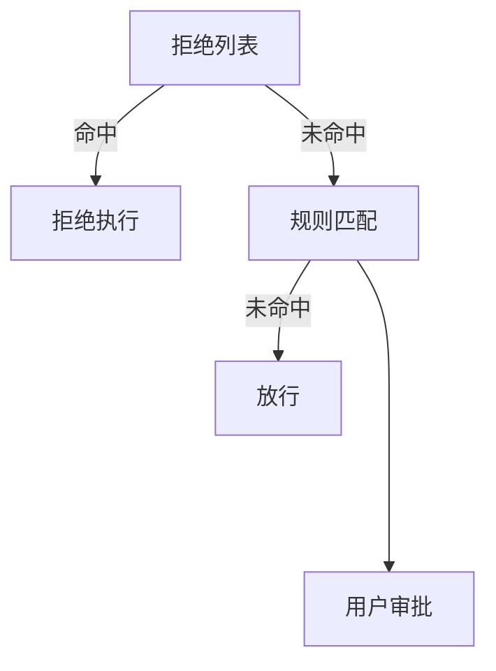

这一节讲权限，在工具执行前先做权限判断。

设计了三道闸门：
|闸门 | 作用 | **命中后**|**未命中**|
|---|---|---|---|
|拒绝列表 | 永远禁止的操作（rm -rf /、sudo）| 直接拒绝，不执行|继续规则匹配|
|规则匹配 | 描述什么时候需要问用户（写工作区外、rm 文件）| 交给闸门 3|**直接放行**|
|用户审批 | 闸门 2 命中后，暂停等用户允许或拒绝 |-|-|

> 简单字符串匹配可能被绕过，教学中为了简化使用字符串匹配。

第一遍理解错了，以为唯一的出口必须经过三道闸门，后来发现第二道闸门未匹配也可以放行。



执行示例（加了一个打印tool input，更加透明）

```bash
(learn-claude-code) gkunix@laptopGK:~/workspace/learn-claude-code$ python ./s03_permission/code.py
s03: Permission
输入问题，回车发送。输入 q 退出。

[36ms03 >> [0mcreate file and naming it as s03_test.txt in ./
>Tool name: bash
        Input key: command       Input vlaue: touch ./s03_test.txt
(no output)
>Tool name: bash
        Input key: command       Input vlaue: ls -la ./s03_test.txt
-rw-r--r-- 1 gkunix gkunix 0 Jul 16 16:23 ./s03_test.txt
Confirmed — `./s03_test.txt` has been successfully created (empty file, 0 bytes).

[36ms03 >> [0mdelete the file you just created.
>Tool name: bash
        Input key: command       Input vlaue: rm ./s03_test.txt

⚠  Potentially destructive command
   Tool: bash({'command': 'rm ./s03_test.txt'})
   Allow? [y/N] y
(no output)
>Tool name: bash
        Input key: command       Input vlaue: ls -la ./s03_test.txt 2>&1
ls: cannot access './s03_test.txt': No such file or directory
Confirmed — `s03_test.txt` has been successfully deleted and no longer exists in the directory.

[36ms03 >> [0m
```
